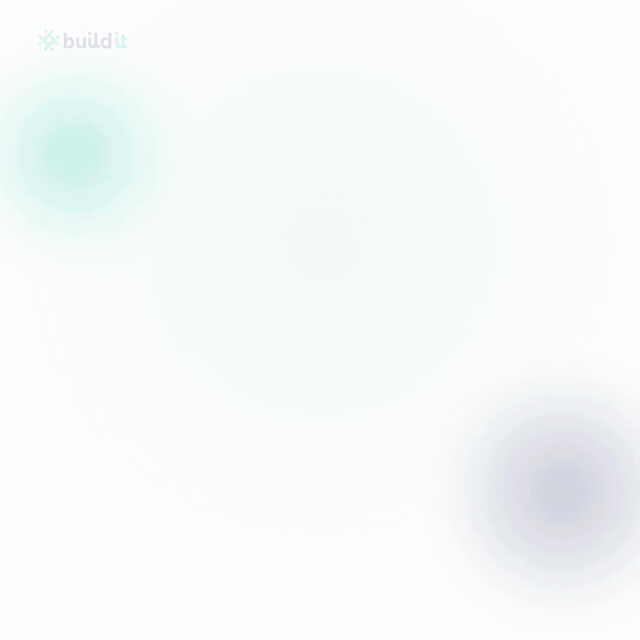

<p align="center">
  <picture>
    <source media="(prefers-color-scheme: dark)" srcset="assets/logo-dark.svg">
    
  </picture>
</p>

<p align="center">
  <strong>Remotion for Rails.</strong> Make videos from your app's own components and data,
  written in Ruby — no React, no video editor, no After Effects.
</p>

<p align="center">
  <a href="https://github.com/growth-constant/animate_it/actions/workflows/ci.yml"></a>
  <a href="https://rubygems.org/gems/animate_it"></a>
  = 3.3">
</p>

---

[Remotion](https://www.remotion.dev/) made it possible to build videos in React.
**AnimateIt brings the same idea to Ruby on Rails** — without React, a JavaScript
project, or a video editor.

You describe a video as a Ruby class and a HAML or ERB template, preview it in a
bundled **Studio** UI, and render it to MP4/WebM/MOV/GIF. The declarative runtime
renders the template once per structural layer, records compact animation tracks,
and seeks those tracks in the browser. You still get your app's own components,
styles, fonts, and real data without asking Rails to render every frame.

It's built for indie hackers and Rails developers who want to promote their projects
with polished product demos, launch clips, and social ads — reusing the UI they've
already built, staying in Ruby, and skipping the whole "learn a video editor" detour.

<p align="center">
  
</p>

<p align="center">
  <em>Rendered from Rails views, ViewComponents, and deterministic browser animation tracks.</em>
</p>

## Requirements

- Ruby >= 3.3, Rails >= 7.2 (tested against Rails 7.2 and 8.1)
- **FFmpeg** on the PATH (rendering)
- **Node + Playwright** with a Chromium build (rendering): `npx playwright install chromium`
- **HAML** (composition sidecar templates + Studio views)

Playwright and FFmpeg are only needed when you actually render; the gem loads
Playwright lazily so production boot / asset precompile never touch it.

## Installation

```ruby
# Gemfile
gem "animate_it"
```

```bash
bundle install
bin/rails generate animate_it:install
```

The generator adds `config/initializers/animate_it.rb` and mounts the Studio in
`config/routes.rb` (development/test only):

```ruby
mount AnimateIt::Engine, at: AnimateIt.config.mount_path if Rails.env.local?
```

Visit **http://localhost:3000/animate_it** to open the Studio.

## Writing a composition

Compositions live in `app/videos/`. They auto-register (via the `id "..."` DSL)
and reload in development.

```ruby
# app/videos/hello_video.rb
class HelloVideo < AnimateIt::Composition
  id "hello"
  client_driven!
  fps 30
  size 1080, 1080
  duration 3.seconds

  props do
    integer :counter_start, default: 0
  end
  verification_props({}, { counter_start: 100 })

  assets_dir "app/assets/images/videos"
  output_basename "hello"

  outputs do
    mp4
    gif
    png frame: 45
  end

  beat :intro, at: 0, length: 45

  class Scene < AnimateIt::Scene
    track_vars :root do
      { title_opacity: at_act(:intro, [0, 30], [0, 1]) }
    end

    text_track(:counter) { (props[:counter_start] + local_frame).to_s }

    def body
      absolute_fill(vars: :root) do
        safe_join([render_scene_template("canvas"), animate_text(:counter)])
      end
    end
  end

  scene Scene
end
```

```haml
-# app/videos/hello_video/canvas.html.haml
:css
  .title { opacity: var(--title-opacity, 1); font-size: 6rem; font-weight: 800; }
.stage
  .title Hello 👋
```

Animation helpers (`at_global`, `at_act`, `beat_frame`, `beat_range`), sampled
CSS variables (`track_vars`), dynamic text (`text_track`), named `beat`s, and
`audio` / `audio_loop` tracks are available. Compositions can render your app's
real partials and ViewComponents — see `AnimateIt.config.render_stylesheets`
below.

### Browser playback runtime

`client_driven!` switches export and Studio playback to `/player`. Rails renders
each structural layer once and records a schema-v2 track document; then
`window.__animateIt.setFrame(frame)` updates CSS variables, text, layer
visibility, word reveals, and native CSS/Web Animations without another frame
request.

Use `structure_epochs` only when a template's DOM shape changes. Each epoch adds
one pre-rendered layer. Track schema v2 scopes bindings to their timeline segment;
the player still accepts v1 documents and rejects unknown versions.

```ruby
structure_epochs 60, 120

class Scene < AnimateIt::Scene
  track_vars(:card) { { x: "#{at_global([0, 30], [-20, 0])}px" } }
  text_track(:score) { (progress * 100).round }

  def body
    absolute_fill(vars: :card) do
      safe_join([render_scene_template("canvas"), animate_text(:score)])
    end
  end
end
```

### Production frontend playback

Public playback is opt-in per composition. `public_player!` enables the
standalone browser clock, Play/Pause control, looping, and synchronized
music/voice/SFX. It does not expose Studio, frame, filmstrip, props, or render
endpoints, and public playback always uses the composition's default props.

```ruby
class HelloVideo < AnimateIt::Composition
  id "hello"
  public_player! autoplay: false, loop: true
  # ...
end
```

Mount the engine in every environment, then embed the allowlisted composition
from a host view:

```ruby
# config/routes.rb
mount AnimateIt::Engine, at: AnimateIt.config.mount_path
```

```erb
<%= animate_it_player "hello", title: "Hello product demo" %>
```

The iframe renders each structural layer once and advances entirely in the
browser. Audio-capable players fall back to the visible Play button when the
browser blocks autoplay.

### HAML or ERB

Scene sidecar templates can be authored in **HAML** (`canvas.html.haml`) or
**ERB** (`canvas.html.erb`) — Rails resolves whichever file exists, so you can
mix engines across scenes. The HAML canvas above is equivalent to:

```erb
<%# app/videos/hello_video/canvas.html.erb %>
<style>.title { opacity: var(--title-opacity, 1); font-size: 6rem; font-weight: 800; }</style>
<div class="stage">
  <div class="title">Hello 👋</div>
</div>
```

The gem bundles HAML for its own Studio UI, so you never need to add HAML to your
app to use it — ERB-only apps work out of the box.

## Rendering

The renderer needs your Rails **server running**. It drives a real browser
against `/player` for client-driven compositions and the legacy `/filmstrip`
endpoint for other compositions.

```bash
# start the app
bin/rails server

# in another shell — render a composition's declared outputs
bin/rails 'animate_it:render[hello]'
bin/rails 'animate_it:render[hello,0..45]'   # just a frame range

# compare /player with the legacy /filmstrip (step 1 checks every frame)
bin/rails 'animate_it:verify[hello,1]'
bin/rails animate_it:verify_all

# or the packaged CLI (writes to tmp/animate_it/ by default)
bundle exec render_animate_it_video hello
bundle exec render_animate_it_video hello tmp/hello.mp4
```

You can also render from the **Studio** UI: open a composition, scrub the timeline,
and click **Render Video** to watch progress live.

### Host resolution

The renderer points the browser at `ANIMATE_IT_HOST` (falling back to the legacy
`RAILS_MOTION_HOST`, then `RAILS_HOST`, then `http://127.0.0.1:3000`):

```bash
ANIMATE_IT_HOST=http://127.0.0.1:3001 bundle exec render_animate_it_video hello
```

## Configuration

```ruby
# config/initializers/animate_it.rb
AnimateIt.configure do |config|
  # Where the Studio mounts (development/test only). Default "/animate_it".
  config.mount_path = "/animate_it"

  # Host stylesheets to inject into every rendered frame. Only needed when your
  # compositions re-use host partials/components that expect their CSS. Names
  # are passed to `stylesheet_link_tag`. Default [].
  config.render_stylesheets = %w[application components/star-ratings]
end
```

When one composition declares multiple formats for the same frame range,
AnimateIt captures the ordered Chromium frames once and reuses them for each
encoder. Studio rendering intentionally keeps one sequential capture stream so
frame ordering, progress, and cancellation stay deterministic.

## Deterministic asset preflight

Host applications can record local composition inputs in
`config/animate_it_assets.yml`. `bin/rails animate_it:preflight` checks that each
file exists, matches its SHA-256 checksum, and has a provenance provider. Media
stays in the host app and is not packaged in the gem.

```yaml
version: 1
assets:
  - path: app/audio/launch/music.mp3
    kind: music
    compositions: [hello]
    sha256: 0123456789abcdef0123456789abcdef0123456789abcdef0123456789abcdef
    provenance:
      provider: elevenlabs
      generated_with_ai: true
      model_id: not-recorded
      generation_id: not-recorded
```

For parameterized compositions, declare `verification_props` or override them
at the command line:

```bash
ANIMATE_IT_PROPS_JSON='{"title":"Variant"}' bin/rails 'animate_it:verify[hello,1]'
ANIMATE_IT_PROPS_MATRIX_JSON='[{}, {"title":"Variant"}]' bin/rails animate_it:verify_all
```

Verification requires a running server and writes comparison screenshots under
`tmp/animate_it/verify`.

## Claude skill

If you use [Claude Code](https://claude.com/claude-code), this repo ships an
Agent Skill that teaches Claude how to author AnimateIt compositions — the DSL,
the render pipeline, embedding, rendering your app's real partials, motion
craft, and the gotchas. Install it into your project's `.claude/skills/`:

```bash
npx animate-it-skills          # copies the skill into ./.claude/skills
```

The skill source lives in [`skills/`](skills/).

## Development

```bash
bin/setup                # bundle install
bundle exec rspec        # unit + request specs (uses spec/dummy)
bundle exec rubocop
gem build animate_it.gemspec

# full render smoke test (needs ffmpeg + Playwright chromium)
RUN_RENDER_SMOKE=1 bundle exec rspec spec/rendering_spec.rb

# run the suite against a specific Rails version (see Appraisals)
bundle exec appraisal install
bundle exec appraisal rails-7.2 rspec
bundle exec appraisal rails-8.1 rspec
```

Specs run against a minimal host app in `spec/dummy` — no external services, no
database.

## Credits

AnimateIt is inspired by [**Remotion**](https://www.remotion.dev) — the framework
that pioneered making videos programmatically in React. AnimateIt brings that
"videos as code" idea to the Ruby on Rails ecosystem, natively and without React.
Huge thanks to the Remotion team for the inspiration.

## License

AnimateIt is released under the [**MIT License**](MIT-LICENSE) — free and open source,
with **no restrictions on commercial or business use**. Individuals, startups,
agencies, and companies of any size can use it in open-source and closed-source
projects at no cost, forever. No paid tiers, no seat limits.
